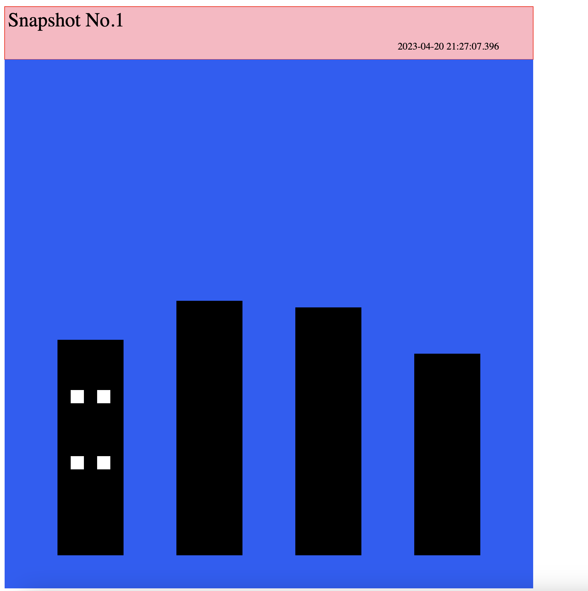
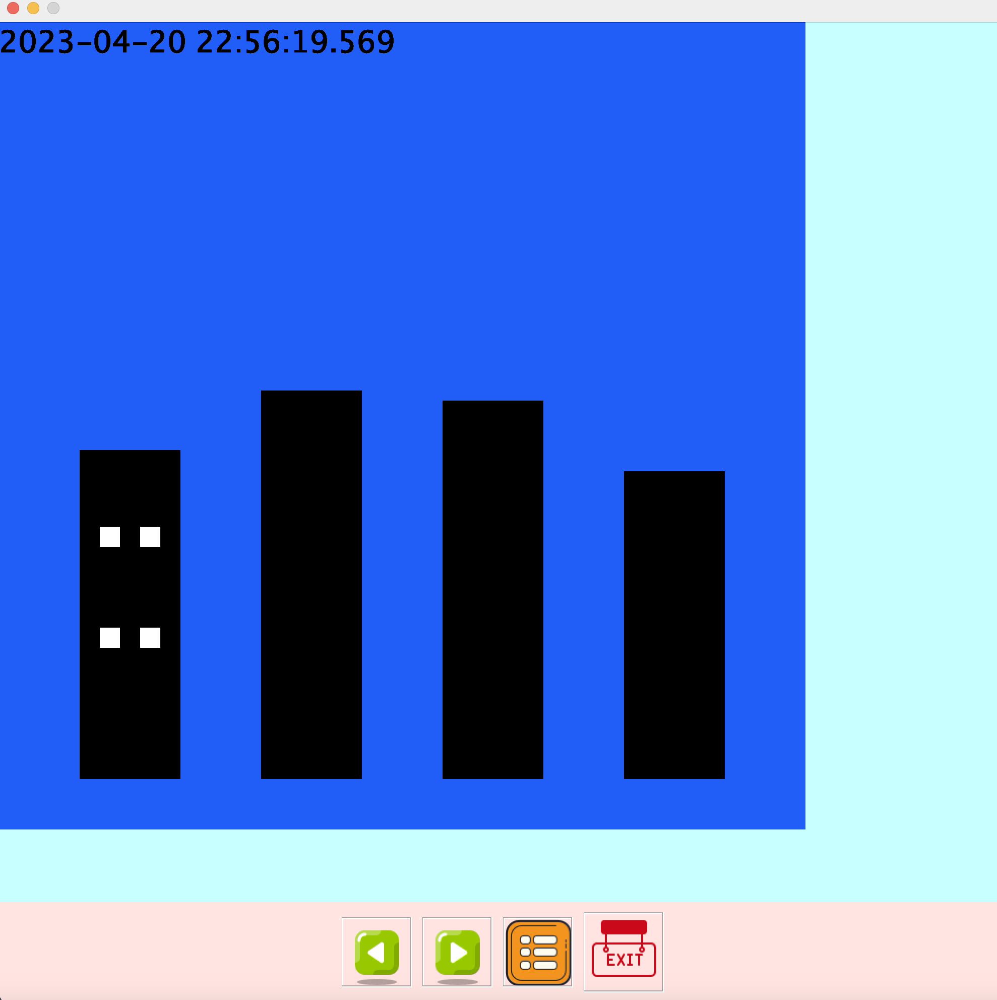

Shapes Photo Album
==================

*   **Author**: Jen Ting, Huang
*   **Semester**: Spring 2023
*   **Languages Used**: Java

Table of contents
-----------------

*   [About The Project](#about-the-project)
*   [Architectural Approach](#architectural-approach)
*   [Design Pattern](#design-pattern)
*   [Getting Started](#getting-started)

About The Project
-----------------

The Shapes Photo Album is an application that allows users to create photo models from shapes. The main functions of the photo model include putting shapes on the canvas, changing the size, location, and color of the shapes, and taking snapshots of the current status on the canvas.

This project is divided into two parts:

*   [Part 1](#part-1): Implementing the model functionality for the shape model.
*   [Part 2](#part-2): Implementing the view and controller functionality for the shape model.

Changes Made From Part 2
------------

In the process of working on this project, several changes were made to the original codebase. These changes include:
* Shape Interface
  *   Added get/set methods for width and height in the Shape interface, with the data type set to integer.
  *   Removed getArea() and getPerimeter() methods in the Shape interface.

        `Note`:  Adding / Removing a method from an interface that is implemented by many classes can lead to breaking changes in the implementation classes, and could require a significant amount of refactoring. Since it's a small project, I did go back and refactor my code. But in the future, I will consider doing the following: 

        1. Think carefully about the methods you include in your interface before publishing it. Only include methods that are truly necessary for the functionality of your program.
        2. Consider using default methods or creating a new interface that extends the existing one to avoid breaking changes.
* Shape class
  *   Removed the Circle and Square classes, and made only the Oval class and Rectangle class instead. I found out that square can be created by rectangle and circle can be created by oval. This simplified the code.
* Canvas model
  *   Created a model interface because users do not need to know the implementation details of the class.
  *   Removed `out-of-bound validation` checks for shapes on the canvas, as it was discovered that users could still add shapes even if they were out of bounds.
  *   Changed the snapshot ID to be passed in nanoseconds to avoid duplicates.

**Part 1**
----------------------

Architectural Approach
----------------------

For this project, we have chosen the `MVC` (Model-View-Controller) pattern in software design, which is commonly used to implement user interfaces, data, and controlling logic. It emphasizes a separation between the software's business logic and display.

In part 1 of the shape model, we have implemented the model part, which focuses on implementing the functionality for the shape model. The model holds all the data, state, and application logic.

Design Pattern
--------------

We have chosen two design patterns for this project:

1.  Creational Design Pattern: `Factory Method Pattern`
    *   Single responsibility: The logic for creating shapes is isolated in one place, rather than being scattered throughout the codebase.
2.  Behavioral Design Pattern: `Command Design Pattern`
    *   Single Responsibility Principle: By separating the responsibilities of the invoker, command, and receiver, it makes it easier to modify or extend the application without affecting other parts of the system.
    *   Open-Closed Principle: Extensions to add a new command are easy and can be done without changing the existing code.
    *   Supporting Undo Functionality: The Command pattern is particularly useful for implementing undo/redo functionality, allowing you to store a history of executed commands and easily revert or redo actions as needed.
    *   Enabling Task Scheduling: Using the Command pattern, you can easily schedule tasks to be executed at different times, and even reorder or remove tasks from the queue as needed.

**Part 2**
----------------------

Web View
--------

The Web View is an implementation of the View component in the Shape Model that is designed to be displayed in a web browser. It uses HTML and SVG to render the `static` shape canvas.

### Features

*   Render the canvas and shapes using SVG.
*   Display a list of shapes on the canvas.


Graphical View
--------------

The Graphical View is an implementation of the View component in the Shape Model that is designed to be displayed as a graphical user interface (GUI) on a desktop computer. It uses Java Swing to render the shape canvas and allow users to `interact` with the interface.

### Features

*   Render the canvas and shapes using Java Swing components.
*   Display a list of shapes on the canvas.
*   Allow users to view and switch between snapshots.


Getting Started
---------------
1. Create a command file and put it in `/src/assets/commandinputfile`.

For example:
```
# Make a rectangle and oval. Color red and green
    shape   myrect   rectangle  200  200 50  100  255  0  0
    shape   myoval   oval       500  100 60  30   0 255 1

# Take a snapshot. Optional description text follows snapshot command
    snapShot After first selfie

    move myrect     300     200
    resize myrect   25      100
    move myrect     100     300

# Take another snapshot. Again, optional description included
# Snapshot descriptions go up to the end of the line (no multi-line descriptions to worry about)
    snapShot 2nd selfie

# Change rectangle color to blue. Move the oval
    color myrect    0  0  255
    move myoval     500   400

# Another snapshot. This time, descriptive text is omitted.
    snapShot

# Remove the rectangle, then take one more snapshot
    remove myrect
    snapshot Selfie after removing the rectangle from the picture
```
- `\#` (Comment) - The code will ignore it. 
- `shape`: Creates a new shape. Followed by these attributes:
  - `ID` - textual name for the shape
  - `Type` - type of shape (only rectangles and ovals for this assignment)
  - `x position` - coordinate system for both Swing and SVG starts in upper left corner
  - `y position` - coordinate system for both Swing and SVG starts in upper left corner
  - `width` - or "first dimension" like radius_x. for ovals
  - `height` - or "second dimension" like radius_y for ovals
  - `red` - RGB red value
  - `green` - RGB green value
  - `blue` - RGB blue value

- `move`: Moves a shape to a new x, y position
  - `ID` - text name for the shape
  - `x position` - coordinate system for both Swing and SVG starts in upper left corner
  - `y position` - coordinate system for both Swing and SVG starts in upper left corner

- `color`: Changes the color of a shape
  - `red` - RGB red value
  - `green` - RGB green value
  - `blue` - RGB blue value

- `resize`: Resizes the shape
  - `width` - or "first dimension" like radius_x. for ovals
  - `height` - or "second dimension" like radius_y for ovals

- `remove`: Removes the shape
  - `ID` - text name for shape to remove

- `snapshot`: Tells the model to take a snapshot of the current state of the album
  - `description` (optional) - optional text that the command file can use to tag the snapshot with extra information

2. Go to `/resources`, and you should see the `ShapAlbum.jar`.
3. Open your terminal in this directory.
4. If you need **Web** view of the Shape album.
  - Run: `java -jar ShapAlbum.jar -in <your input file> -view web -out <output html file>`
  - For example: `java -jar ShapAlbum.jar -in buildings.txt -view web -out out.html`
  


5. If you need **Graphical** view of the Shape album.
  - Run: `java -jar ShapAlbum.jar -in <your input file> -view graphical <xmax> <ymax>`
  - For example: `java -jar ShapAlbum.jar -in buildings.txt -view graphical 1000 1000`
  - `Note`: 
  The `xmax` and `ymax` are optional integers that specify the bounds of the "Graphical view window". If these attributes are not specified, a default value of 1000 is used for both x (width) and y (height).
  
